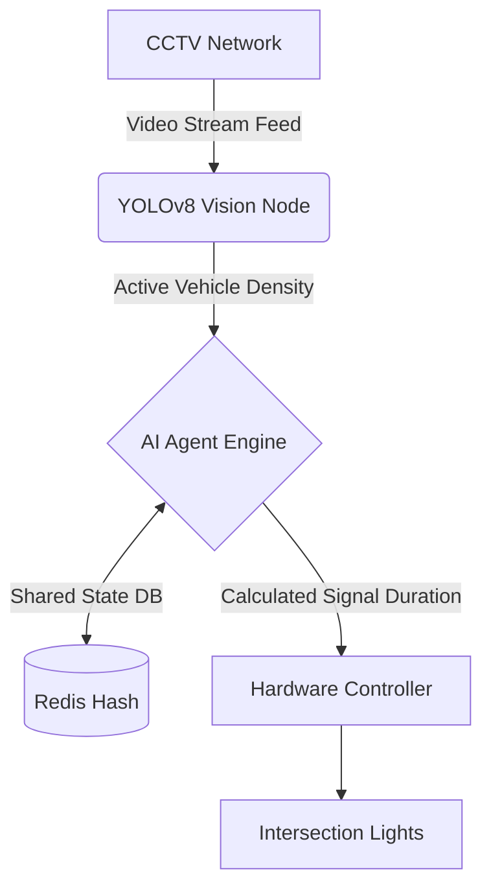
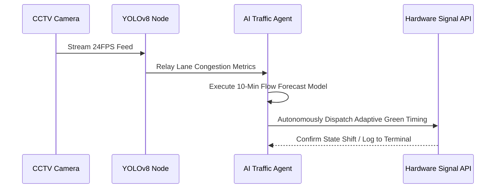

<div align="center">
  <h1>🚦 SIGNAL.X</h1>
  <h3>Autonomous Multi-Agent Traffic Optimization System</h3>
  
  <p>
    
    
    
    
  </p>
</div>

## 📌 Executive Summary
Current urban traffic systems are static, relying on fixed, pre-programmed timers that cause unnecessary congestion and increased carbon emissions. **SIGNAL.X** transforms city infrastructure into a dynamic, intelligent network using an **autonomous multi-agent system** that optimizes traffic flow in real-time via live lane density analysis and adaptive signal control.

## 🏆 Innovation & Impact
- **Multi-Agent Decision Engine:** Beyond a simple dashboard, SIGNAL.X utilizes autonomous agents that dynamically adjust signal durations based on live intersection payload data.
- **High-Fidelity Visual Simulation:** A built-in interactive physics canvas that perfectly simulates vehicle flow and bumper-to-bumper queue detection without needing a physical intersection.
- **Real-World Scalability:** Designed to directly ingest YOLOv8 object detection streams from existing municipal CCTV infrastructure via API—a highly feasible, low-cost Smart City upgrade.
- **Explainable AI Pipeline:** Features transparent AI agent behavior logging, ensuring that every signal state change is fully auditable and structurally sound.

## 🧠 System Architecture



## ⚙️ Autonomous Agent Workflow



## 💻 Technology Stack
- **Simulation Layer:** Native HTML5 Canvas Engine, Advanced CSS Variables (Glassmorphic Spec)
- **Vision Integration Layer:** YOLOv8 Object Detection compatibility
- **Data Visualization:** Chart.js Integration for real-time congestion tracking

## 🚀 Installation & Cloning Guide
Want to test the autonomous simulation locally? It takes less than 10 seconds.

1. **Clone the Repository:** 
   ```bash
   git clone https://github.com/vaishnavi-ctrl-jpg/SIGNAL-X.git
   ```
2. **Navigate to the Directory:**
   ```bash
   cd SIGNAL-X
   ```
3. **Launch Application:** 
   Simply double-click the `INDEX.html` file to open it directly in any modern web browser (Edge, Chrome, Safari).
   
**No Dependencies:** Zero build-steps, no `npm install`, and no complex configurations required for evaluation.

## 🔮 Roadmap / Future Implementation
- **Emergency Override:** V2 includes direct routing channels for localized dispatching of emergency vehicles.
- **Cloud Meshing:** AWS/GCP architecture mapping to synchronize multiple adjacent intersections dynamically.

<div align="center">
  <br/>
  <i>Developed for the next generation of urban mobility.</i>
</div>
