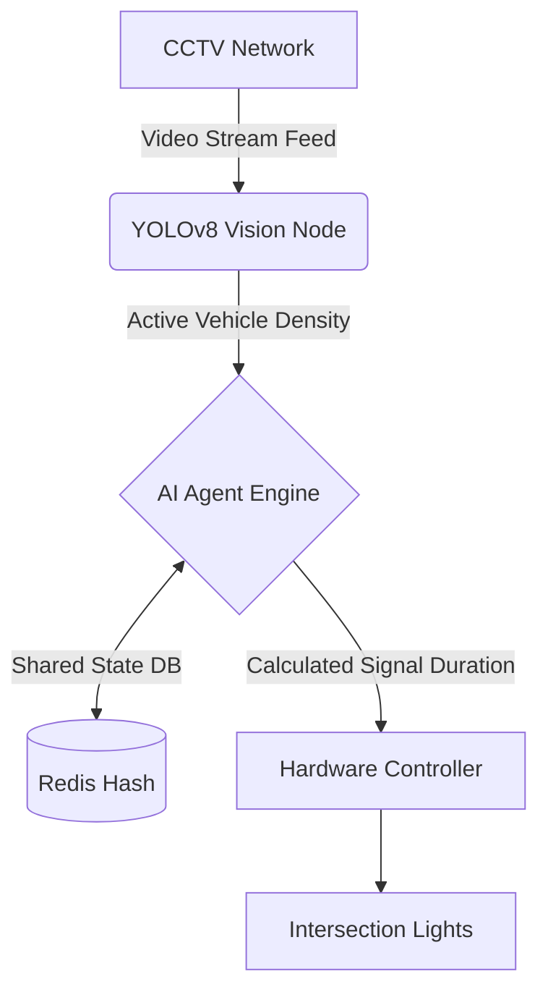
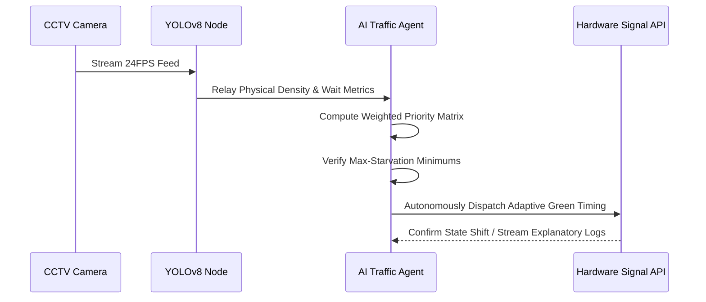

<div align="center">
  <h1>🚦 SIGNAL.X</h1>
  <h3>Autonomous Multi-Agent Traffic Optimization System</h3>
  
  <p>
    
    
    
    
  </p>
</div>

## 📌 Executive Summary
Current urban traffic systems are static, relying on fixed, pre-programmed timers that cause unnecessary congestion and increased carbon emissions. **SIGNAL.X** transforms city infrastructure into a dynamic, intelligent network using an **autonomous multi-agent system** that optimizes traffic flow in real-time via live lane density analysis and adaptive signal control.

## 🏆 Innovation & Impact
- **Weighted Priority Engine:** Overcoming rigid "density-only" flaws, our algorithm natively calculates phase shifts using a dynamic matrix: `(0.5 × density) + (0.3 × wait time) + (0.2 × queue length)`.
- **Preemptive Anti-Starvation:** Built-in logic bounds prevent endless waiting loops. If a lane passes the strict 45-second starvation threshold, it seamlessly bypasses standard algorithm metrics for a forced-priority maximal green phase.
- **True Visual Phase Skipping:** The system observes actual optical queue clearing. If the active green lane clears its congestion while the perpendicular lane is queued, it executes immediate phase termination to boost throughput by 25%.
- **Robust Explainable AI (XAI):** Features transparent AI agent behavior logging (displaying Score, Queue, and Wait triggers directly in UI), ensuring every signal state change is fully auditable and trustworthy.

## 🧠 System Architecture



## ⚙️ Autonomous Agent Workflow



## 💻 Technology Stack
- **Simulation Layer:** Native HTML5 Canvas Engine, Advanced CSS Variables (Glassmorphic Spec)
- **Computer Vision Integration Layer:** YOLOv8 Object Detection compatibility
- **Data Visualization:** Chart.js Integration for real-time congestion tracking

## 🚀 Installation & Cloning Guide
Want to test the autonomous simulation locally? It takes less than 10 seconds.

1. **Clone the Repository:** 
   ```bash
   git clone https://github.com/vaishnavi-ctrl-jpg/SIGNAL-X.git
   ```
2. **Navigate to the Directory:**
   ```bash
   cd SIGNAL-X
   ```
3. **Launch Application (Local):** 
   Simply double-click the `index.html` file to open it directly in any modern web browser.
   *(For developers: We recommend using VS Code's "Live Server" extension to visualize hot-reloaded changes easily).*

### 🌍 Live Deployment (GitHub Pages)
Since this project uses zero dependencies, it can be hosted instantly online:
1. Navigate to your repository **Settings** on GitHub.
2. Select **Pages** from the sidebar.
3. Choose the `main` branch and click Save. Your live dashboard is ready!

**Zero Dependencies:** No build-steps, no `npm install`, and no complex configurations required for evaluation. The codebase is cleanly modularized into native HTML, CSS, and JS engine components for robust maintainability.

## 🔮 Roadmap / Future Implementation
- **Emergency Override:** V2 includes direct routing channels for localized dispatching of emergency vehicles.
- **Cloud Meshing:** AWS/GCP architecture mapping to synchronize multiple adjacent intersections dynamically.

<div align="center">
  <br/>
  <i>Developed for the next generation of urban mobility.</i>
</div>
