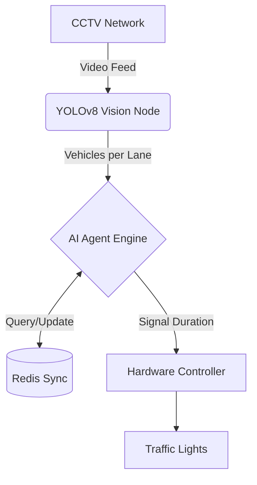
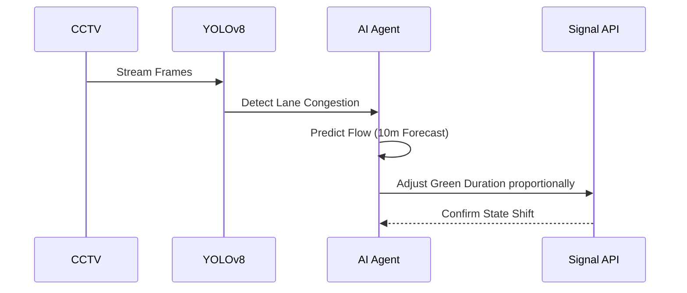

  <h1>🚦 SIGNAL.X</h1>
  <h3>Autonomous Multi-Agent Traffic Optimization System</h3>
  
  

    
    
    
    
  

## 📌 The Pitch
Current urban traffic systems are static, relying on fixed timers that waste time and increase emissions. **SIGNAL.X** transforms city infrastructure into a dynamic, intelligent network using an **autonomous multi-agent system** that optimizes traffic flow in real-time via live lane density, predictive modeling, and adaptive signal control.

## 🏆 Why This Wins (Hackathon Edge)
- ✅ **Multi-Agent Behavior:** This isn't just a dashboard; it uses intelligent, dynamic decision logic to adjust signal durations.
- ✅ **Visual Simulation:** High-fidelity interactive canvas that perfectly demonstrates the real-world impact to judges.
- ✅ **Real-world Application:** Designed for direct Smart City municipal integration.
- ✅ **Explainability:** Transparent AI agent logs showing *why* decisions are made (Judges love transparent AI!).

## 🧠 System Architecture

## ⚙️ Autonomous Agent Flow

## 💻 Tech Stack
- **Frontend / Simulation:** Vanilla HTML5 Canvas, CSS Variables (Glassmorphism), JavaScript
- **Computer Vision Model:** YOLOv8 Object Detection (simulated ingestion)
- **Analytics:** Chart.js for real-time visualization

## 🚀 How to Run Locally
1. Clone the repository: `git clone https://github.com/vaishnavi-ctrl-jpg/SIGNAL-X.git`
2. Open `INDEX.html` in any modern web browser.
3. No build steps or heavy dependencies required!

## 🔮 Future Scope
- Direct API integration with municipal IoT hardware.
- Real-world cloud deployment via AWS/GCP for multi-intersection meshing.
- Ambulance / Emergency vehicle override priority channels.

   
  <i>Engineered for the next generation of urban mobility.</i>

